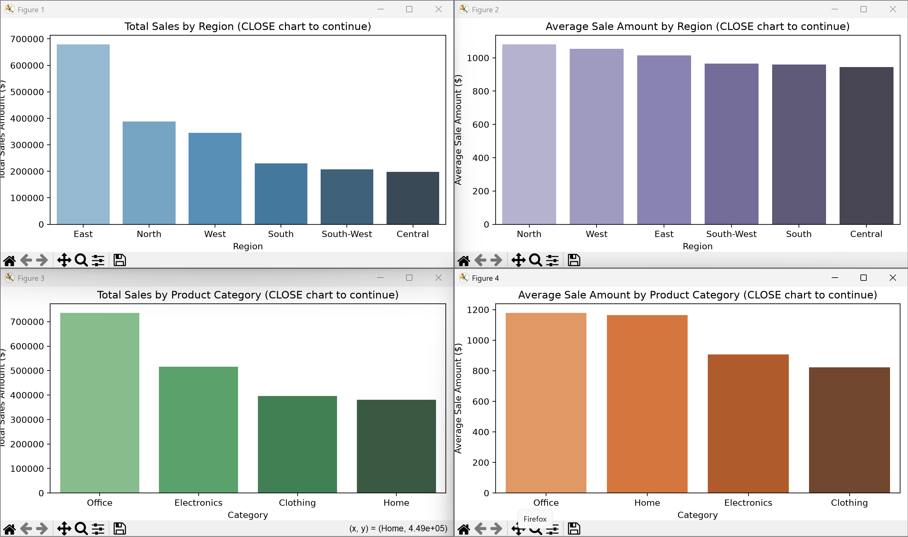

# Project Documentation

This site provides project documentation.
Use the documentation navigation to explore.

## How-To Guide

Many instructions are common to all our projects.

See
[⭐ **Workflow: Apply Example**](https://denisecase.github.io/pro-analytics-02/workflow-b-apply-example-project/)
to get the example projects running on your machine.

## Project Documentation Pages (docs/)

- **Home** - this documentation landing page
- [**Project Instructions**](./project-instructions.md)  - the standard project workflow
- [**Your Files**](./your-files.md) - how to copy the example and create your version
- [**Glossary**](./glossary.md) - project terms and concepts
- [**API**](./api.md) - autogenerated code documentation for the public project interface

---

## Phase 4. Technical Modification

For my technical modification, I added a new analysis that calculates
the average sale amount by region.

I chose this change because the original project already calculated total
sales by region, but total sales alone do not show the average value of
each sale. Comparing average sale amounts provides another way to analyze
regional sales performance.

I created a new function to group the sales data by region and calculate
the average `SaleAmount`. I also added a new bar chart titled
**Average Sale Amount by Region**.

I verified the modification by running the project with:

`uv run python -m bizintel.app_abdel`

The project completed successfully and displayed the new chart. The
results showed that the North region had the highest average sale amount
at approximately $1,081.63.

Compared with the original example project, my version includes an
additional metric and visualization for average sales by region. This
change matters because a region with high total sales does not necessarily
have the highest average sale amount.

The modification was moderately challenging because I needed to understand
how the existing functions were organized before adding my own function
while keeping the original project structure.

## Phase 5. Custom Project (OPTIONAL in Module 1)

For my custom project, I expanded the smart sales analysis by adding
average sale amount by product category.

### Basis and Data

The project uses three raw data files located in `data/raw/`:

- `customers_data.csv` contains customer information such as customer ID,
  name, and region.
- `products_data.csv` contains product information such as product ID,
  product name, category, and unit price.
- `sales_data.csv` contains sales transactions including transaction ID,
  sale date, customer ID, product ID, and sale amount.

The data is provided as part of the example business intelligence project
and represents smart sales business data.

During my first exploration, I did not notice major data quality issues
that prevented the project from running. However, the data should still
be checked for missing values, duplicate records, and unusual values before
using it for real business decisions.

An important limitation is that the data is example project data and may
not represent the complexity of a real company's sales environment.

### Business Questions

The East region appears to have the highest total sales based on the
regional sales analysis.

The product data contains different unit prices across the available
product categories. Product prices and sale amounts should be reviewed
further to identify unusually high or low values.

The project successfully loaded 201 customer records, 100 product records,
and 2,001 sales records. I did not notice a major data quality problem
during the initial analysis.

Some business questions I would want to answer include:

- Which product category generates the highest average sale amount?
- Which region generates the highest total sales?
- Which region has the highest average sale amount?
- Which product categories generate higher-value sales transactions?
- Are there major differences in customer purchasing behavior by region?

### Summary

I explored the data using VS Code and Python. I ran the project, reviewed
the terminal log output, and analyzed the generated bar charts.

What surprised me was that the region with the highest total sales was
not the same region with the highest average sale amount. The East region
had the highest total sales, while the North region had the highest average
sale amount at approximately $1,081.63.

For Phase 5, I added a new analysis of average sale amount by product
category. The analysis showed that the Office category had the highest
average sale amount at approximately $1,179.84.

I learned that data preparation and analysis require looking at multiple
metrics instead of relying on only one result. Total sales and average
sale amount provide different information about business performance.

This data could help answer real business questions related to regional
sales performance, product category performance, customer purchasing
behavior, and data-driven business decisions.

